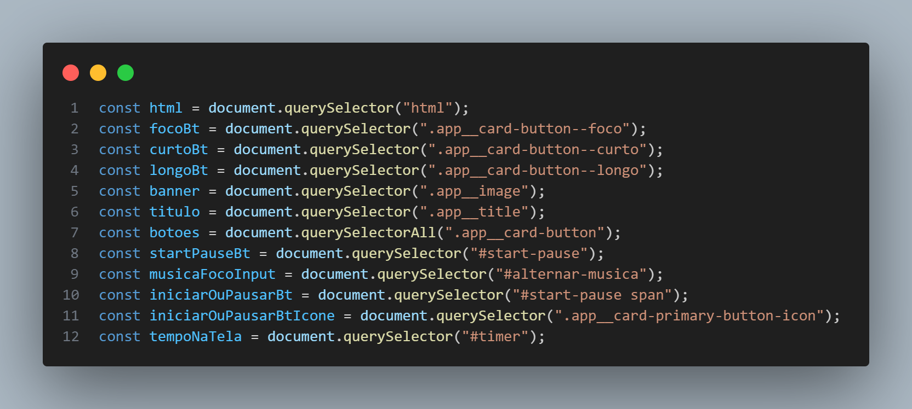

# Fokus

Projeto desenvolvido no Curso Manipulando dados com DOM, fornecido pela Alura e ministrado pelo instrutor Luan Alves.

Fokus é um aplicativo web que utiliza a técnica de Pomodoro para ajudar na gestão do tempo e aumentar a produtividade. 
Com períodos de foco, descanso curto e descanso longo, 
o aplicativo permite que você se concentre nas tarefas de forma mais eficiente,
mantendo uma boa relação entre trabalho e descanso.

## Como usar: 
- Abra o projeto no navegador [Clique aqui](https://fokus-lime.vercel.app/)

## Recursos
- Timer Personalizado: Escolha entre períodos de foco, descanso curto e descanso longo.
- Música de Fundo: Ative ou desative a música de fundo.
- Contagem Regressiva: Acompanhe o tempo restante em um timer visual.
- Design Responsivo: A interface se adapta a diferentes tamanhos de tela.

## Tecnologias Utilizadas
- HTML5
- CSS3 (incluindo Flexbox e Media Queries)
- JavaScript

## Funcionalidades JavaScript
O código JavaScript fornecido implementa uma aplicação de temporizador Pomodoro. Vamos analisar o que foi aprendido no código:

## Seleção de Elementos do DOM :
- Essas linhas de código selecionam vários elementos do HTML usando document.querySelector e document.querySelectorAll.
Esses elementos incluem botões, imagens, elementos de áudio e outros componentes da interface do usuário utilizados na aplicação Pomodoro.

## Inicialização de Objetos de Áudio :
- Objetos de áudio são criados usando o construtor Audio. Esses objetos são utilizados para reproduzir música de fundo,
efeitos sonoros de play e pause, e um som final quando o temporizador atinge zero.

## Variáveis do Temporizador :
- Essas variáveis armazenam o tempo atual em contagem regressiva em segundos (tempoDecorridoEmSegundos)
e o ID do intervalo definido por setInterval (intervaloId), que é usado para atualizar o temporizador.

## Event Listeners :
- Esses ouvintes de eventos respondem a interações do usuário, como cliques em botões, e realizam ações correspondentes,
como iniciar ou pausar o temporizador, alterar o contexto (foco, pausa curta, pausa longa), e controlar a reprodução de áudio.

## Funções :
- Essas funções executam tarefas específicas na aplicação, como alterar o contexto,
realizar a contagem regressiva, iniciar ou pausar o temporizador, reiniciar o temporizador, e exibir o tempo na tela.

  

